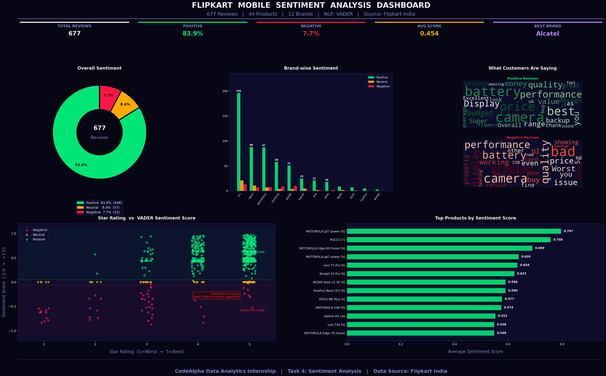

# 📱 Flipkart Mobile Market & Sentiment Analysis

**CodeAlpha Data Analytics Internship — All 4 Tasks Completed**

> An end-to-end data analytics project combining Web Scraping, EDA, Business Intelligence Dashboards, and NLP-based Sentiment Analysis on real Flipkart mobile review data.

---

## 👤 Author

**Yash Shrivastav** — CodeAlpha Data Analytics Intern

---

## 📊 Project at a Glance

| Metric | Value |
|--------|-------|
| Total Reviews Analyzed | **677** |
| Unique Products | **44** |
| Brands Covered | **12** |
| Positive Sentiment | **83.9%** (568 reviews) |
| Neutral Sentiment | **8.4%** (57 reviews) |
| Negative Sentiment | **7.7%** (52 reviews) |
| Avg Sentiment Score | **0.454** |
| Best Brand (by score) | **Alcatel** (0.623) |
| Top Product | **MOTOROLA g57 power 5G** (score: 0.797) |
| Price Range | **₹7,999 – ₹82,900** |
| Avg Price | **₹14,940** |

---

## ✅ Internship Tasks Completed

| Task | Description | Tools Used | Status |
|------|-------------|------------|--------|
| Task 1 | Web Scraping | ParseHub, Octoparse | ✅ Done |
| Task 2 | Exploratory Data Analysis | Python, Pandas, Excel | ✅ Done |
| Task 3 | Data Visualization | Tableau, Matplotlib | ✅ Done |
| Task 4 | Sentiment Analysis | NLTK, VADER | ✅ Done |

---

## 🗂️ Repository Structure

```
CodeAlpha_Flipkart_Mobile_Analysis/
│
├── datasets/
│   ├── run_results.csv                                      # Extracted data Via Parsehub product data
│   ├── run_results Cleaned.xlsx                             # Cleaned Product data
│   ├── Poco C85x Emerald Green 64 Gb Reviews_ Latest Review # Extracted data Via Octoparse Reviews data
│   ├── run_results_Cleaned_Pivot.xlsx                       # EDA pivot tables and observation
│   ├── Mobile_Reviews_Dataset.xlsx                          # Matched product + review dataset (677 rows, 11 cols)
│   ├── Mobile_Reviews_Dataset.csv                           # CSV version
│   ├── reviews_with_sentiment.csv                           # Dataset with Sentiment & Sentiment_Score columns
│
├── dashboards/
│   ├── sentiment_dashboard.png            # Python Matplotlib dashboard (Task 4)
│   └── tableau_dashboard.png             # Tableau dashboard screenshot (Task 3)
│
├── python_scripts/
│   ├── sentiment.py                       # VADER NLP sentiment classification script
│   └── sentiment_dashboard.py            # Full 5-chart Python dashboard
│
├── presentation/
│   └── Final_PPT_Yash_Shrivastav.pptx    # 12-slide internship presentation
│
└── README.md
```

---

## 🔧 Task 1 — Web Scraping

**Objective:** Collect real-world mobile market data from Flipkart India.

**Tools:** ParseHub (product data) · Octoparse (customer reviews)

**What was collected:**

| Field | Description |
|-------|-------------|
| Brand | Mobile brand name |
| Base_Model | Base model name |
| Product_Name | Full product name with variant |
| Price_INR | Price in Indian Rupees |
| Color | Product color variant |
| Storage | Storage capacity (GB) |
| Rating | Star rating (1–5) |
| Review_Headline | Short review title |
| Review_Text | Full customer review |
| Reviewer_Name | Name of reviewer |
| Date | Review date |

**Output:** 677 reviews across 12 brands, 44 products, 85 product variants

---

## 🔍 Task 2 — Exploratory Data Analysis (EDA)

**Objective:** Understand data structure, identify patterns, anomalies, and trends.

### Key EDA Findings

**Rating Distribution:**
- 5-star: 414 reviews (61.2%) — strong positivity bias
- 4-star: 168 reviews (24.8%)
- 3-star: 64 reviews (9.5%)
- 2-star: 15 reviews (2.2%)
- 1-star: 16 reviews (2.4%)
- **Average Rating: 4.40**

**Price Analysis:**
- Min: ₹7,999 | Max: ₹82,900 | Avg: ₹14,940
- Apple highest avg: ₹72,067
- Ai+ lowest avg: ₹8,425
- **Price–Rating correlation: 0.073** → price does NOT guarantee satisfaction

**Storage:**
- 128GB: 321 units (most popular)
- 64GB: 118 units
- 256GB: 56 units
- 512GB: 6 units (highest sentiment score: 0.545)
- 176 null values identified and documented

**Anomaly Detection:**
- 6 reviews: 5-star rating but negative text (hidden dissatisfaction)
- realme Narzo 90x 5G: only product with net-negative score (−0.392)

**Brand Insights:**
- Ai+ dominates review volume: 230 reviews (34%) — dataset imbalance noted
- IQOO and OnePlus: 0% negative reviews (small sample — 8 and 5 reviews)

---

## 📊 Task 3 — Data Visualization

**Objective:** Transform data into clear, actionable visual formats.

### Tableau Dashboard (`dashboards/tableau_dashboard.png`)

Built an interactive business intelligence dashboard with:
- **Total Products by Brand** — bar chart showing brand-wise product count
- **Average Price by Brand** — brand pricing comparison (Apple leads at ₹72,067)
- **Storage-wise Average Price** — pie chart (128GB avg ₹17,574 vs 64GB avg ₹10,701)
- **KPI Cards** — Total Phones: 162 | Avg Price: ₹13,713

## Tableau Dashboard


## 🧠 Task 4 — Sentiment Analysis (NLP)

**Objective:** Classify customer reviews using NLP and generate business insights.

### Method: VADER (Valence Aware Dictionary and sEntiment Reasoner)

```python
from nltk.sentiment.vader import SentimentIntensityAnalyzer
analyzer = SentimentIntensityAnalyzer()

# Thresholds (compound score):
# Positive  ≥ +0.05
# Neutral   between -0.05 and +0.05
# Negative  ≤ -0.05
```

### Results

| Sentiment | Count | Percentage |
|-----------|-------|------------|
| Positive | 568 | 83.9% |
| Neutral | 57 | 8.4% |
| Negative | 52 | 7.7% |

### Brand-wise Sentiment Scores

| Brand | Avg Score | Negative % |
|-------|-----------|------------|
| Alcatel | 0.623 | 0.0% |
| OnePlus | 0.590 | 0.0% |
| IQOO | 0.518 | 0.0% |
| MOTOROLA | 0.516 | 7.8% |
| vivo | 0.483 | 4.2% |
| Ai+ | 0.451 | 5.7% |
| POCO | 0.448 | 6.6% |
| Samsung | 0.435 | **12.7%** |
| REDMI | 0.376 | **15.4%** ⚠️ |

### Top & Bottom Products

| Rank | Product | Score |
|------|---------|-------|
| 🥇 1 | MOTOROLA g57 power 5G | 0.797 |
| 🥈 2 | POCO C71 | 0.758 |
| 🥉 3 | MOTOROLA Edge 60 Fusion 5G | 0.690 |
| ⬇️ Last | realme Narzo 90x 5G | −0.392 |

### Top Keywords

- **Positive reviews:** camera, battery, best, price, performance, display, quality, budget, money, value
- **Negative reviews:** camera, quality, battery, problem, performance, display, price, worst, working

### Python Matplotlib Dashboard (`dashboards/sentiment_dashboard.png`)

5-chart professional dark-theme dashboard:
- **Donut Chart** — Overall sentiment distribution (83.9% / 8.4% / 7.7%)
- **Grouped Bar Chart** — Brand-wise Positive/Neutral/Negative counts
- **Word Clouds** — Top keywords from Positive and Negative reviews separately
- **Scatter Plot** — Star Rating vs VADER Sentiment Score (with mismatch annotation)
- **Horizontal Bar Chart** — Top 13 products ranked by avg sentiment score
- 
## Sentiment Dashboard



## 💡 Key Insights

1. **83.9% positive sentiment** — Flipkart mobile buyers are largely satisfied
2. **Camera & battery** drive the most positive reviews — key marketing levers
3. **Price ≠ satisfaction** — correlation of 0.073; value-for-money matters more
4. **REDMI has the highest complaint rate** (15.4%) — quality and service need attention
5. **6 mismatch reviews** — 5-star rated but negatively written; hidden dissatisfaction exists
6. **512GB segment** scores highest sentiment (0.545) — premium buyers are happiest
7. **Negative reviews are longer** (avg 86 chars) vs neutral (42 chars) — unhappy buyers explain more

---

## 📣 Business Recommendations

1. **Improve budget segment quality** — REDMI (15.4%) and Samsung (12.7%) face the most complaints
2. **Market camera and battery** — these keywords dominate positive reviews across all brands
3. **Implement NLP review monitoring** — star ratings alone miss 6+ hidden dissatisfied customers
4. **Study MOTOROLA's strategy** — g57 power 5G (0.797) is the top sentiment performer

---

## 🔮 Future Scope

- Implement ML-based models (BERT, RoBERTa) for higher accuracy sentiment analysis
- Build real-time dashboard using Streamlit for live review monitoring
- Extend analysis to Amazon, Meesho, and other marketplaces
- Apply emotion detection (joy, anger, fear) beyond basic polarity classification
- Add time-series sentiment trends as more reviews are collected

---

## 🛠️ Tech Stack

| Category | Tools |
|----------|-------|
| Web Scraping | ParseHub, Octoparse |
| Data Analysis | Python 3, Pandas, NumPy |
| Spreadsheet EDA | Microsoft Excel, Pivot Tables |
| Visualization | Tableau Public, Matplotlib, WordCloud |
| NLP | NLTK, VADER Sentiment Analyzer |
| Presentation | PowerPoint (pptxgenjs) |

---

## 🚀 How to Run

```bash
# 1. Install dependencies
pip install pandas nltk matplotlib wordcloud openpyxl

# 2. Run sentiment classification
python python_scripts/sentiment.py

# 3. Generate the dashboard
python python_scripts/sentiment_dashboard.py
```

---

*CodeAlpha Data Analytics Internship | Yash Shrivastav*
